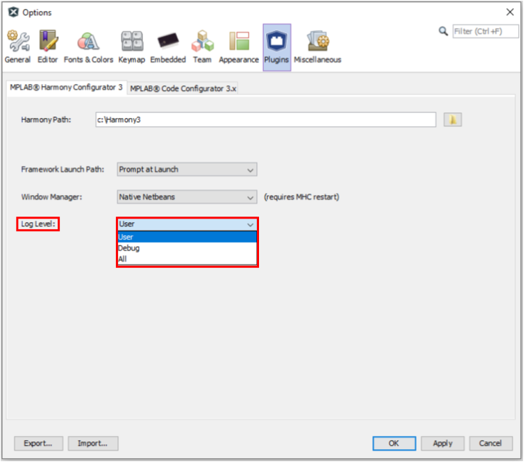
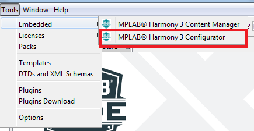
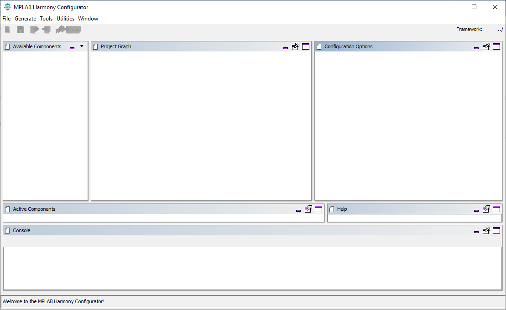

# Contents Summary

# Table of contents
{: .no_toc .text-delta }

1. TOC
{:toc}

---

# Installing MPLAB® Harmony v3 with Content manager
 Please refer to [Harmony Content Manager](https://github.com/Microchip-MPLAB-Harmony/contentmanager/wiki) to install the required software tools and download the Harmony Packages you intend to use to get started with Harmony 3.
 * [MPLAB® X IDE](https://www.microchip.com/mplab/embedded-software-center)
 * [XC32 Compiler](https://www.microchip.com/mplab/compilers)
 * [MPLAB® Harmony Configurator (MHC) Plugin](https://github.com/Microchip-MPLAB-Harmony/mhc/wiki)
 * [List of devices supported by MPLAB® Harmony](https://github.com/Microchip-MPLAB-Harmony/Microchip-MPLAB-Harmony.github.io/wiki/device_support)

# Configuring MHC Plugin to select Window manager and log level
Select MHC Plugin configuration using ***Tools > Options > Plugins > MPLAB® Harmony Configurator 3***
## Window manager selection
The MHC plug-in will open either in a new window (standalone mode) or inside MPLAB® X window (native mode). Select window manager mode

## Log Level selection
There are three levels of logging available (ALL, DEBUG, USER). MHC displays the logs in the console window (seen at the bottom of the main window). It also saves them in the mhc.log file under .mh3 folder in user's home directory. This log level decides the kind of messages that will get logged.  Select the log level

# Creating MPLAB® Harmony 3 Project using MPLAB® X IDE

To create a new MPLAB® X IDE Harmony 3 project, launch the MPLAB® X IDE.
1. Launch the New Project Wizard using one of the following methods:
   * **From the Toolbar**: Click on the New Project icon , or
   * **From the Menu**: Select File -> New Project, or
   * **From the Keyboard**: Ctrl + Shift + N

2. Choose "32-bit MPLAB® Harmony 3 Project" and Click Next

    

3. Specify the location where the Harmony 3 repositories have been downloaded with content manager, then click Next.

    

4. Specify Project Name, Location and Folder
    - Location: Indicates the path to the root folder of the new project. All project files will be placed in this folder.
    - Folder: Indicates the physical name of the MPLAB® X .X project folder (Absolute location is indicated in Path). This allows creation of multiple projects in the same location.
    - Name: Indicates the logical name of the MPLAB® X Project
    

    **Note**: Click the "Show Visual Help" button to open a contextual help window for a detailed description of various fields in the Project Settings.

5. Select Device and Specify configuration name

    

    **Notes**:
     - Click the "Show Visual Help" button to open a contextual help window for a detailed description of various fields in the Configuration Settings.
     - After clicking the Finish button, if MHC does not launch, user can launch it by selecting **Tools > Embedded > MPLAB® Harmony 3 Configurator** from the MPLAB® X IDE.

# Launching MPLAB® Harmony Configurator (MHC)

Follow these steps to launch the MHC.

1. Open the MHC plugin tool by selecting **Tools > Embedded > MPLAB® Harmony 3 Configurator**

2. If necessary, reconfigure the MPLAB® X Harmony framework paths by clicking the Reconfigure Paths button. Otherwise, accept the default settings and then click Launch.

# MHC User Interface

This section provides brief overview of MHC user interface in standalone window mode

## Available Components

All the modules, for which corresponding package has been downloaded, are listed in this window. Board Support Package (BSP) and Peripherals list the modules which are applicable for the device for which project has been created. The rest of the components are listed for all the devices.

## Active Components

This window lists all the modules which are being used in the project. To use a module, user needs to double click on the module from the Available Components list. Some of the modules are added in the active list by default, such as the Device Family Pack (DFP), System, and others. To remove a module from use (or from the Active Components list), select the module to be removed, then click on the red cross button appearing in the left top side of the Active Components window.

## Project Graph

The Project Graph shows all the modules being used in the project, but with more details. in the project graph, two or more modules can be connected to reflect their dependencies.

## Configuration Options

This window provides a separate configuration option for every module. Once user selects a module either in the project graph or from the available components list, all the configuration options of the corresponding module are shown in this window.

## Tools

MPLAB® Harmony provides tools which can be used to configure some of the modules which are difficult to configure in tree view, such as Clock Configuration, Pin configuration, ADC Configuration, etc.
They need to be launched through **Tools** menu option of the MPLAB® Harmony Configurator window in standalone mode (or ***MHC>Tools*** menu option of the MPLAB® X IDE in native mode).

## Console

Console window is used to display MHC related messages. For example, if some direct dependency is not satisfied and an attempt is made to generate the code, then the console window throws an error message.

## News

This window shows up the latest Harmony release related news so that user can be aware of different releases happenning.

## Help

Help Window is currently not implemented. It is planned to show component's configuration related help to the user in future.

# Configuration and Code Generation

## Configuration

Refer to [MHC Wiki](https://github.com/Microchip-MPLAB-Harmony/mhc/wiki) for more detailed information on MHC usage to add required software components and configure it as per your application requirement.

## Generate Code

Click Generate Code button  once all the required modules are added and it pops up the following window to select the merge strategy.  

## Merge Strategy

User can select different code merging strategy using this option. description of each merge strategy can be seen by clicking "?" button as marked in above image. Here is the merge strategy description for your quick reference:
   

# Running MPLAB® X Harmony 3 Project

Following steps need to be done to run MPLAB® Harmony project:

- Once the Harmony code is generated, user application should be developed in "main.c" or "app.c".
- In MPLAB® X Project properties, appropriate compiler, hardware tools and DFP should be selected as shown in the figure below.

- Project can be then build and programmed using MPLAB® X "Make and Program Device Main Project" option.

# Creating a New TrustZone Project

To create a new TrustZone project, in MPLAB® X IDE, Select File > New Project or click . The New Project wizard will open. Perform following steps:

1. Choose Project:
   - In the Choose Project pane, select the Microchip Embedded category.
   - In the Projects pane, select 32-bit MPLAB® Harmony 3 Project, then click Next.
    

    **Note**: If the 32-Bit MPLAB® Harmony 3 Project type is not listed under the Microchip Embedded category, please download and install MPLAB® Harmony 3 Configurator before continuing with these steps.
2. Framework Selection:
   - Provide the framework path where Harmony 3 repositorries have been downloaded, then click Next.

    

3. Project Settings:
    - Location: Indicates the path to the root folder of the new project. All project files will be placed in this folder.
    - Folder: Indicates the name of the MPLAB® X IDE folder.
    - Name: Enter name of the project which you want to see in MPLAB® X IDE, click Next.
    - Path: The path information will be updated automatically as and when users make changes to other fields.

    

    **Note**: Click the "Show Visual Help" button to open a contextual help window for a detailed description of various fields in the Project Settings.

4. Configuration Settings:
   - Name: Enter the configuration name.
   - Target Device: Choose target device
   - TrustZone Enabled: Select checkbox and click Finish to launch MPLAB® Harmony Configurator (MHC). After clicking the Finish button, MHC will create Secure and Non-secure MPLAB® X Projects.

    

    **Note**:
     - After clicking the Finish button, if MHC does not launch, user can launch it by selecting
     **Tools > Embedded > MPLAB® Harmony 3 Configurator** from the MPLAB® X IDE.

The MHC plug-in will open either inside MPLAB® X window (native mode) or in a new window (standalone mode). This setting can be done in ***MPLAB® X > Tools > Options > Plugins > MPLAB® Harmony Configurator 3 > Window Manager***.

TrustZone Project uses two projects viz., Secure and Non-Secure Project that work together on the same MCU and offering security isolation between the Trusted and the Non-trusted resources in the device.
- Secure Project:
  - Secure project contains harmony project file harmony.prj. And this project also contains a configuration file for both Secure and Non-secure project.
  - Secure project must be selected as Main Project to launch MHC.
  - Once the Harmony code is generated, Secure user application should be developed in secure "main.c". And "veneer.c" and "veneer.h" files should be used for the Non-secure to Secure function calls and vice versa.
  - Secure project is a loadable project from the Non-secure project. When Secure Project builds it generates Secure Gateway (SG) library ([configuration name]_Secure_sg_veneer.lib) which will be used by the Non-secure project while building the Non-secure project.
- Non-secure Project:
  - Once the Harmony code is generated, Non-secure user application should be developed in Non-secure "main.c".
  - When Non-secure Project builds, it first builds Secure Project and then Non-secure project and  generates target binaries to be executed on the device.

## Runing TrustZone Project

Following steps need to be done to run TrustZone project:
- In MPLAB® X Non-secure Project properties, appropriate compiler, hardware tools and DFP should be selected as shown in the figure below.

- Select Non-secure Project as Main Project, Non-secure Project can be then build and programmed using MPLAB® X "Make and Program Device Main Project" option.

# Creating an IAR or KEIL project using MHC

When creating projects for IAR or KEIL IDEs, MHC is launched as an application (as opposed to a plugin in MPLAB® X, when creating MPLAB® X projects). We refer to this mode of operation of MHC as "standalone" mode throughout this document.  Follow the steps detailed below to create an project for IAR or KEIL using MHC

## Launching MHC in standalone mode

Navigate to the local clone of this repository and run the script that is appropriate for your operating system. That is

* For Windows, run the script **`runmhc.bat`**
* For Linux/MacOS, run the script **`runmhc.sh`**

This will launch the MHC as an application (see below):

## Setting user preferences

User preferences can be set by navigating to File -> Preferences. MHC allows user to configure two preferences

* **Diff** - Allows user to configure a diff tool. This is an important configuration, and is explained further down in project generation section. We can configure any third party diff tool. To set diff tool,  navigate to its installation directory using the browse button and select the executable. {0} and {1} are place holders for the files that need to diffed during project file generation. In this example, we are using WinMerge as the diff tool.

    

* **Log** - Allows user to set the log level. There are three levels of logging available (ALL, DEBUG, USER). MHC displays the logs in the console window (seen at the bottom of the main window). It also saves them in the mhc.log file under .mh3 folder in user's home directory. This log level decides the kind of messages that will get logged.

    

## Creating a new configuration

To create a new mhc configuration, choose File -> New configuration. A new configuration creation dialog will popup, where we can enter the details of the configuration that we are about to create.

* **Framework Path** - This is not configurable. Framework path defaults to the parent folder of the MHC repository. This folder is should contain relevant harmony 3 repositories required for project creation. Recommend using content manager for downloading and setting up  Harmony 3 repositories. Make sure that the "Convert to relative path for configuration" check box is unchecked.

* **Project information** - Under project information, user can choose the location of the project, name of the project and the name of the configuration.
  * *Location* - Location where the project and configuration will be created
  * *Project name*  -Used by MHC when creating projects for target IDEs. If you want a KEIL or IAR project with specific name, it should be entered in this field
  * *Configuration name* - Used by MHC when creating configuration data
  * *Path* - Shows the location where the new configuration will be created. Paths used by MHC for creating the project and configuration follows these rules
    * configuration information will be created under  `<location>/firmware/source/config/<configuration_name>` folder. In this example it will be "D:\Projects\My_Harmony_3\firmware\src\config\default" folder
    * IDE projects will be created under `<location>/firmware/<configuration_name>.<IDE name>` folder. In this example, if we choose to create an IAR project, it will be created under "D:\Projects\My_Harmony_3\firmware\default.IAR" folder

* **Configuration Options** - Allows us to choose the target device of this confifuration. Device Family drop down limits the options to a specific family when choosing the target device, while Device Filter allows searching for a device by entering few characters.  In this instance, ATSAMC21N18A MCU is chosen for creating the configuration.

Clicking finish button will popup a confirmation dialog. We can change the default Device Family Pack (DFP) and CMSIS Pack used for creating the configuration from this dialog. Click on the launch button to create a new configuration.

## Making changes to the configuration

Refer to documentation on how to use the project graph for configuring Harmony 3 components using mplabx Harmony 3 configurator.

## Generating code and project associated with a configuration

* Select the target toolchain by clicking the system component in the project graph and choosing System -> Project Configuration -> Toolchain selections -> Compilers in the configuration option window. Available options are XC32, IAR and KEIL. Some of these options might not be available for all targets. Choosing IAR or KEIL as the target compiler, will result in MHC creating IAR embedded workbench or Keil uVision IDE projects for the selected target. In this case, we have chosen KEIL as the toolchain.

* Select Generate - > Generate code option in menu bar to start project generation. In the generation window, we can choose the merge strategies.

* Based on the choosen merge startegy, when MHC identifies that there is a diff in the files it generated (for eg: modification within the project IDE), it will launch the configured diff tool. We can bring in the changes that are relevant and ignore the rest. Once the diff tool is closed, the project generation sequence is continued until the entire configuration is generated.

* If IAR or KEIL is chosen as the toolchain, MHC will also create a folder containing the relevant project files which can then be opened using the  corresponding IDE. The path of this folder, follows the rules explained in the "configuration" section. In this example, it would be under "D:\Projects\My_Harmony_3\firmware\default.KEIL", since we choose keil as the the toolchain.
