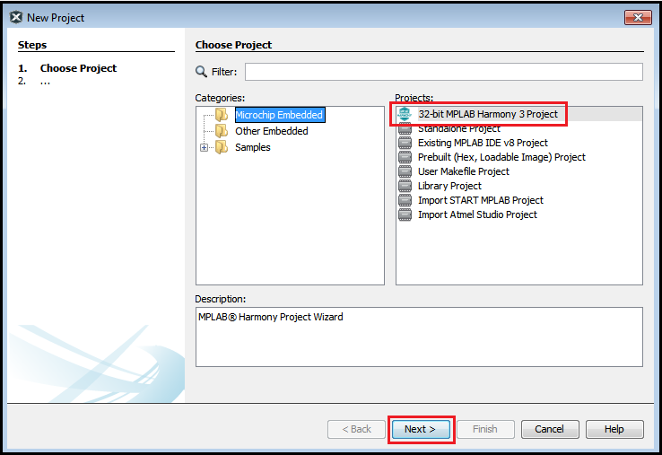
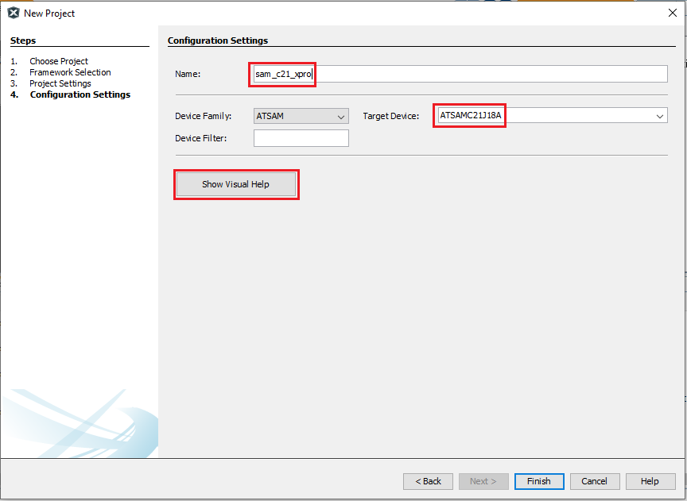

# Creating MPLAB® Harmony 3 Project using MPLAB® X IDE

To create a new MPLAB® X IDE Harmony 3 project, launch the MPLAB® X IDE.
- Launch the New Project Wizard using one of the following methods:
   * **From the Toolbar**: Click on the New Project icon , or
   * **From the Menu**: Select File -> New Project, or
   * **From the Keyboard**: Ctrl + Shift + N

- Choose "32-bit MPLAB® Harmony 3 Project" and Click Next

    

- Specify the location where the Harmony 3 repositories have been downloaded with content manager, then click Next.

    

- Specify Project Name, Location and Folder. 
    - **Location**: Indicates the path to the root folder of the new project. All project files will be placed in this folder.
    - **Folder**: Indicates the physical name of the MPLAB® X .X project folder (Absolute location is indicated in Path). This allows creation of multiple projects in the same location.
    - **Name**: Indicates the logical name of the MPLAB® X Project
	- Click the **Show Visual Help** button to open a contextual help window for a detailed description of various fields in the Configuration Settings.
	
    
	

- Specify configuration name and Select Device. 

    

- Launching MHC from MPLAB X
	* After selecting the target device, click Finish to launch MHC.
	* Users can also launch MHC by selecting **Tools > Embedded > MPLAB® Harmony 3 Configurator** from the MPLAB X IDE
	
	

	* If necessary, reconfigure the MPLAB® X Harmony framework paths by clicking the Reconfigure Paths button. Otherwise, accept the default settings and then click Launch.
	
	

#  Configure and Generate code with MHC
- Refer to [MHC Configuration](./readme_mhc_configuration.md) page for details on how to add, configure and interconnect required software components

- [Save MHC configuration and Generate Code](./readme_generate_code.md). 

- Once the Harmony code is generated, user application should be developed in "main.c" or "app.c".

#  Build and Program with MPLAB X IDE
* In MPLAB® X IDE, go to **File > Project Properties**, and make sure that appropriate compiler version, hardware tools and DFP version should be selected.
	

* Clean and build your application by clicking on the **Clean and Build** button as shown below.
	

* Program your application to the device by clicking on the **Make and Program** button as shown below.
	