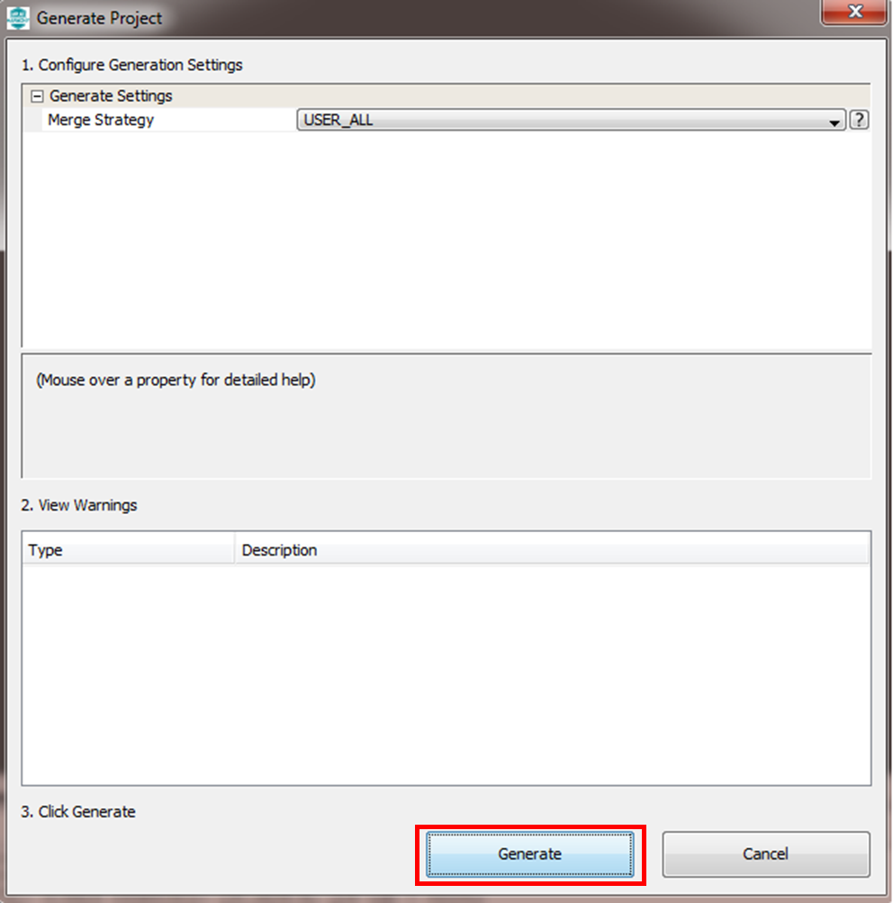
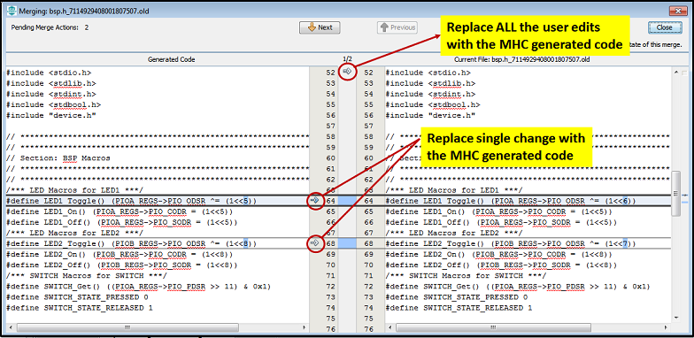

## Saving Configuration and Generating code
- To save the MHC configuration, click the Save icon in MPLAB® Harmony Configurator (MHC) as shown below.

	

- Save the configuration in its default location when prompted. The MHC configuration file is included in the MPLAB® X IDE project, under the Important Files folder. The configuration file uses the extension .xml. 

	

- The users can click the Generate Code button as shown below to generate code and add to the project.

	

- If prompted for saving the configuration, click Save.

	

- Select Merge Strategy and Click on the Generate button in the Generate Project window.
  The description of each merge strategy can be seen by clicking "?" button
  
	

- If any of the files generated by the MHC has been edited outside of MHC and saved to the disk, then the Merge [MHC] window will appear during generation. 
 You must resolve merge conflicts to ensure that all the newly generated code is incorporated into the project.
 
	

- MHC also generates [Project Manifest](./readme_project_manifest.md) to indicate the list of Harmony packages and its versions used in the project.
**Manifest File** is generated in the configuration folder ( /../src/config/config-name/harmony-manifest-success.yml)

