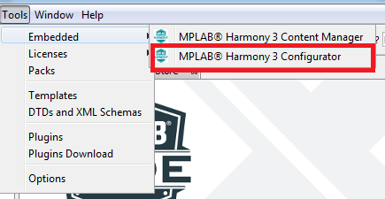
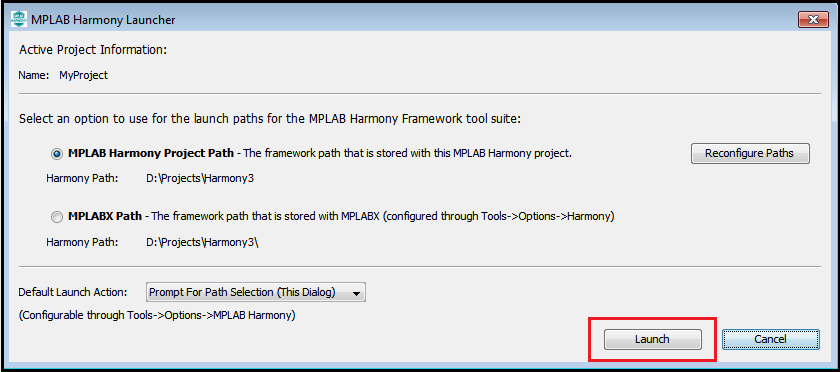
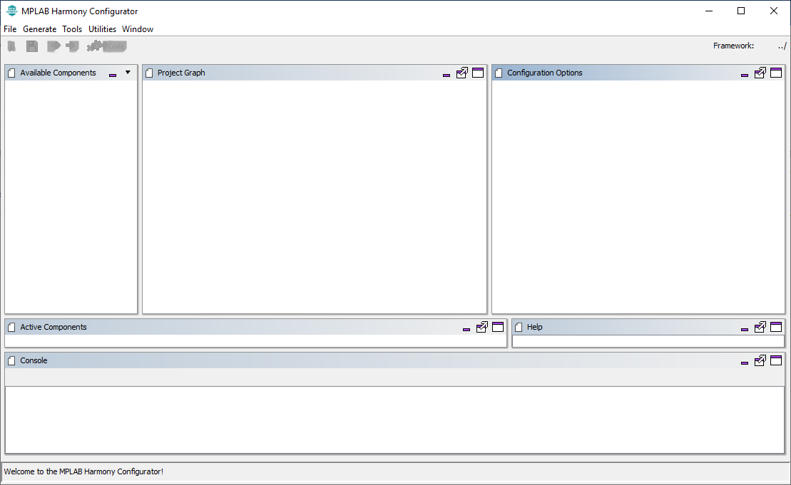
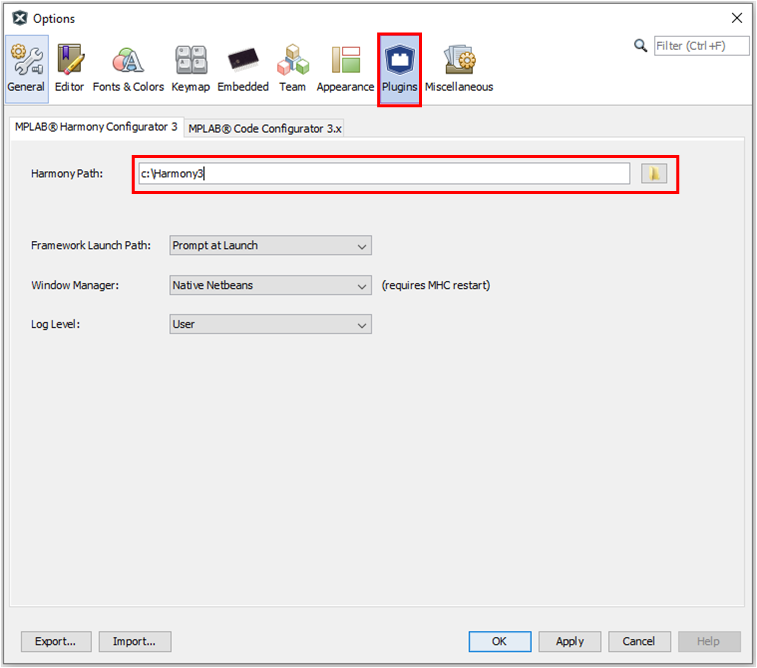
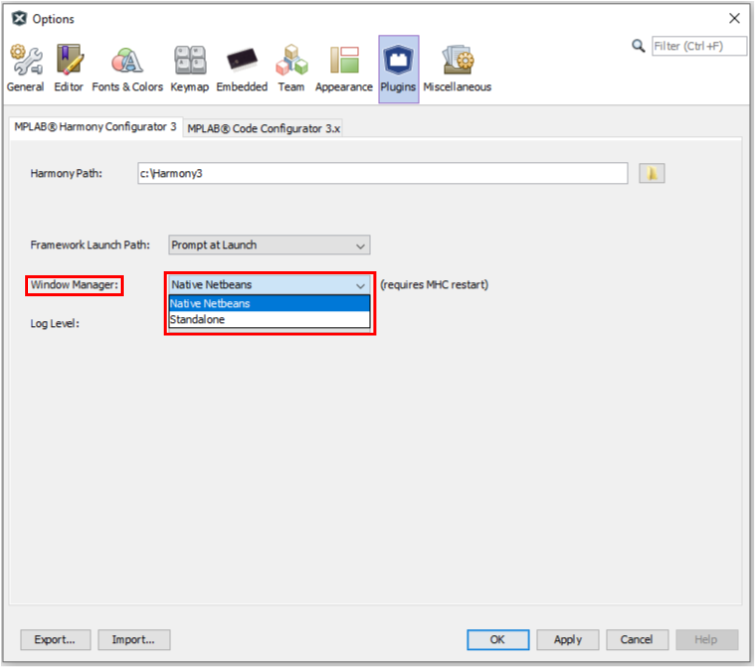
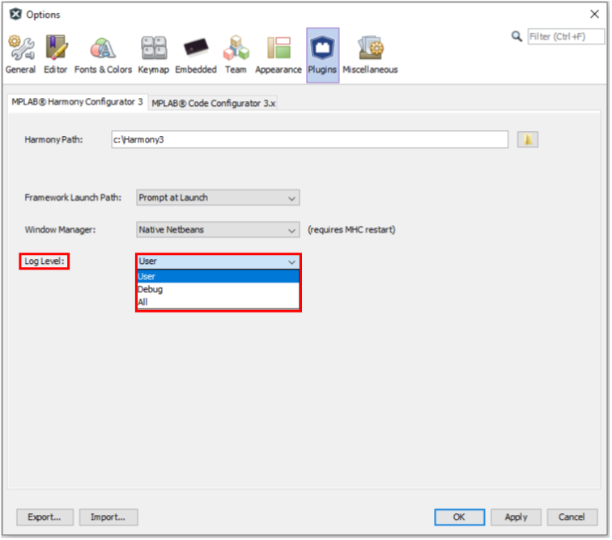

# Launching MHC
The MHC is available as a plugin that directly integrates with the MPLAB® X IDE and as a separate Java executable for standalone use with other development environments.
- Launching MHC as MPLAB X IDE Plug in to create MPLAB X Project.
- Launching MHC as standalone application to create IAR or KEIL Project

# Launching MHC as MPLAB X IDE Pulgin to create MPLAB X Project.
- MHC will launch automically after [Creating MPLAB® Harmony 3 Project using MPLAB® X IDE](./readme_creating_mplabx_project.md)
	
- For existing Harmony 3 Projects, the user can manually launch MHC by selecting **Tools > Embedded > MPLAB® Harmony 3 Configurator** from the MPLAB X IDE  
	
	

- If necessary, reconfigure the MPLAB® X Harmony framework paths by clicking the Reconfigure Paths button. Otherwise, accept the default settings and then click Launch.
	
	

# Launching MHC as standalone  application to create IAR or KEIL Project
When [creating projects for IAR or KEIL IDEs](./readme_creating_iar_keil_project.md), MHC is launched as an standalone application and we refer to this mode of operation of MHC as **standalone** mode.. 
To launch MHC as standalone application, Navigate to the local clone of this repository and run the script that is appropriate for your operating system. 
This will launch the MHC as an standalone application.  
- For Windows, run the script **runmhc.bat**
- For Linux/MacOS, run the script **runmhc.sh**
	

# Configuring MHC Plugin in MPLAB X IDE
Select MHC Plugin configuration using ***Tools > Options > Plugins > MPLAB® Harmony Configurator 3*** to specify the Harmony 3 path, Select Window Manager and Log level.

- Specify the location where the Harmony 3 repositories have been downloaded with content manager, then click Next.
	
	

- Select the required window manager  mode.	The MHC plug-in will open either in a new window (standalone mode) or inside MPLAB® X window (native mode). 
	

- Select the required Log Level. There are three levels of logging available (ALL, DEBUG, USER).
	MHC displays the logs in the console window (seen at the bottom of the main window). 
	It also saves them in the mhc.log file under .mh3 folder in user's home directory. 
	This log level decides the kind of messages that will get logged.  
 
	

