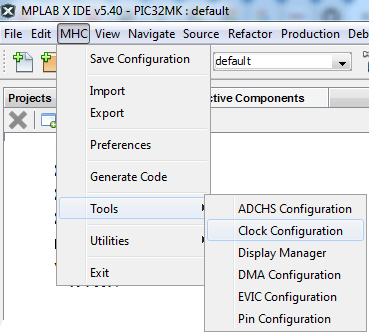

# MPLAB Harmony Configurator Overview

This section provides brief overview of MHC user interface in native Netbeans mode

| Window Name     			| Description                             																																							|
| ---        				| ---                                     																																							|
| Available Components		| Displays the list the list of available components in the downloaded harmony 3 packages that are applicable for the selected target device	     												|
| Active Components    		| Displays activated/instantiated components 																																						|
| Project Graph		    	| Shows the instantiated components and its interconnections    																																	|
| MHC Plugins				| Shows the available custom UI configurators to simplify the peripheral configuration. To open any of these plugins, go to **MHC > Tools** and select the required peripheral UI configurator		|
| Configuration Options		| Displays the tree view of the selected component under Project Graph Area. You can do the component configuration from here.    																	|
| Console			    	| Displays the MHC operation results.         																																						|

Note: 
- The available components are based on the Microcontroller selected while creating the project. 
- All operating areas are dockable. Each can be dragged and dropped into another position, even out of the MPLAB® X IDE main window. 
However, closing the IDE however will close all MHC windows, including the ones moved outside the IDE.

## Adding and Removing component

- To **instantiate a component**, from the available components, double click on any available component or drag and drop it to the Project Graph.
After the component is instantiated, the instantiated component will be displayed in the Project Graph Area. 

- To **remove a component** available in Active component area, follow these steps
	* Select it (for example, FreeRTOS) in Active Component Area or in Project Graph Area then click on **Delete Selected Components** icon .
	* A pop-up window will display asking whether to deactivate a component. The following figure deactivating the FreeRTOS component.
	* Click Yes to deactivate the FreeRTOS component.

## Configuring Component with Treeview

The **Configuration Options** window provides a treeview configuration for the selected component. The user can select the component either in the project graph or from the available components list.

## Configuring component with Customer UI 
The Custom UI configuration are provided for pin, clock, interrupt, DMA and other select peripherals to simplify the configuations. 
Go to **MHC > Tools** and select the required peripheral UI configurator

Note: The available UI configurators will vary based on target device selected. 

## Managing Dependency with Project Graph
In the Project Graph window, each component is shown in the form of a rectangular box. 
- **Dependency**
	* Towards the left-side edge of these rectangular boxes, there are small boxes
	(dependency box) shown, which indicate the dependency of the component. Having a dependency means, the component is dependent on some other component for its correct functionality. 

- **Capability**
	* Towards the right-edge of the rectangular boxes, there will be small boxes (capability box) shown, indicating capability of the component. 
	Having capability means the component is exposing its features to other components.

The following are three **types of dependencies**:
- Direct Dependency is indicated by rhombus terminal and it requires direct connection (one-to-one) to satisfy them. 
For exampe, the **TIME** component in the graph above is connected to **TC0** componet to satify **TMR** dependency.
- Implied Dependency is indicated by circular terminal and it does not need explicit connections to satisfy them. 
For example, the implied dependency of the **TIME**, **SDMMC**, **MEMORY** and **FILE SYSTEM** components in the graph above are satified by the **Core** component that provides Implied Capability for **Core Service**. 
- Multi Dependency is indicated by square terminal and it allows connection to multiple components (One-to-Many). 
For example, the **FILE SYSTEM** component in the graph above is connected **SDMMC** and **MEMORY** component to run File system with multiple media.  

The following are three **types of capabilities**:
- Direct capability is indicated by rhombus terminal and it requires direct connection (one-to-one) to the the client component    
- Implied capability is indicated by circular terminal and it does not need explicit connections to the client component.
- Multi Capability is indicated by square terminal and it allows connection to multiple client components (one-to-many)

The color coding of dependency and capability
- The green color of the box indicates a dependency/capability is already satisfied.
- The red color of the box indicates it needs to be satisfied.
- The yellow color of the box indicates it is optional to satisfy this dependency. 
For example, the **Core** component shows a Implied dependency for **RTOS** that is not satisfied, since this application is bare metal, i.e., without an RTOS.

## Identify and connect to a component that satisfy the dependency
Right-click on the dependency box to find the list of available components that satisfies the dependency, and then select the appropriate satisfier as shown in the following figure

## Identify and connect to a component that consume the capability
Right-click on the capability box to find the list of consumer that satify the capability and then select the appropriate consumper as shown in the following figure

## Deleting connection
To delete an existing connection, right click on either dependency and capability box and then select Disconnect

## Multi-instance Components
Many Harmony drivers can instantiate more than one instance of a driver. Here is an example of an I2C Driver in use:

Clicking on the + icon adds another instance of the driver:

Clicking on the entire I2C component brings up the component's properties in the Configuration Options panel:

Clicking on each driver instance brings up the Configuration Options panel for that instance:

