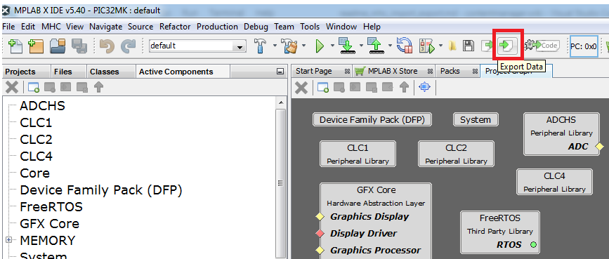

# MPLAB Harmony Import/Export Overview

This section provides brief overview of MHC user interface in Import/Export feature

### Export

The action of saving the selected component’s configuration to an external file is called export.

### Import

Import is action which reads some external configuration of a component or a group of components saved in some external file and incorporate that configuration in the current project.

This import/export feature will help user to selectively save the configuration of components and later send to another user or import it in another project.

If Save Action performed :

1. All MHC configuration will be saved in ".mhc" configuration sub folder (firmware/src/config/configuration/.mhc)

2. All the configurations will be saved in Yaml files.

3. All the components used in graph view will be saved in their respective yml file. Configuration/Components/UniqueComponent or Configuration/Components/GeneratorComponent.

4. Configuration.yml will contain the link of component.yml file.

## Export Data

Export data can be done in two ways:

 1. Export Single Component

 2. Export Multiple Components

### Export Single Component

Right click on any component rectangle in project graph window will display a pop menu with menu item "Export Component". This action will copy the selected component to component.yml file at the user defined location.

### Export multiple components

Multiple Components can be exported by clicking on export icon in ribbon area or from Export menuItem.

Method 1:

Method 2:

Clicking on "Export" will display another dialog displaying all the active component in tree view. User can select multiple components to export at user specified location. This will copy the selected component's yml file to the user specified folder.

Saved Export Data:

### Export Group Component

If user right click on any group component MHC will display a popup menu with option to export the selected component group.

## Import Data

### Import Single/Multiple components

Multiple Components can be imported by clicking on import icon in ribbon area or from Import menuItem.

Method 1:

Method 2:

Clicking on "Import Configuration" will let the user select multiple component.yml files to be loaded in the current project.

* This will copy the selected files to current state and load them in project graph.
* If component is not activated it will activate it if is present in "Available Components" list. Once, component is activated it will update the component list.
* If component is not activated or not present in "Available Components" MHC will display an error message mentioning the component failed to load.
* If imported component depends on another component. MHC will not activate the dependent component. User should export the dependent components together and import them back together.

### Import Group Component

Select group.yml to import internal components of selected group.

