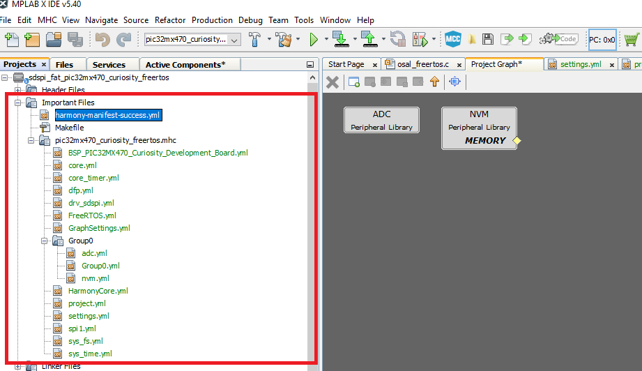
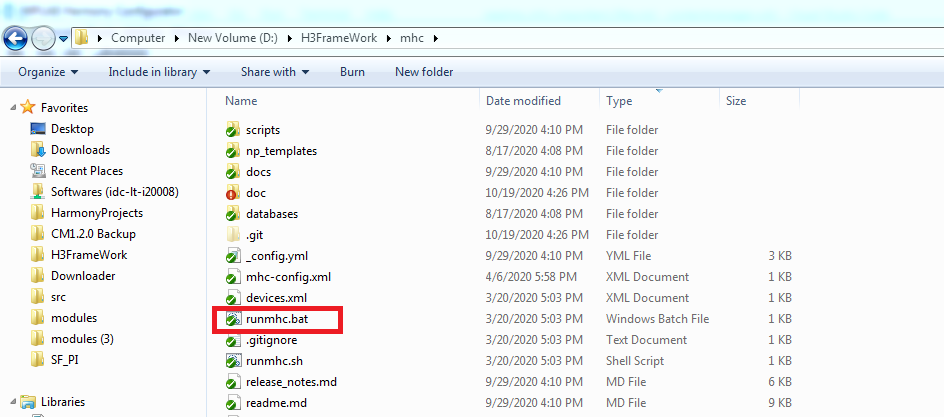
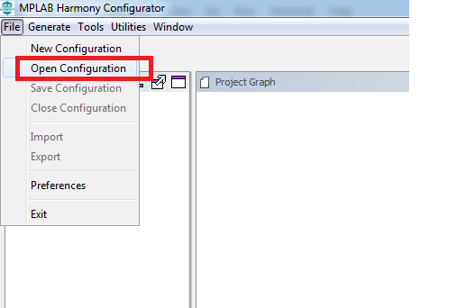
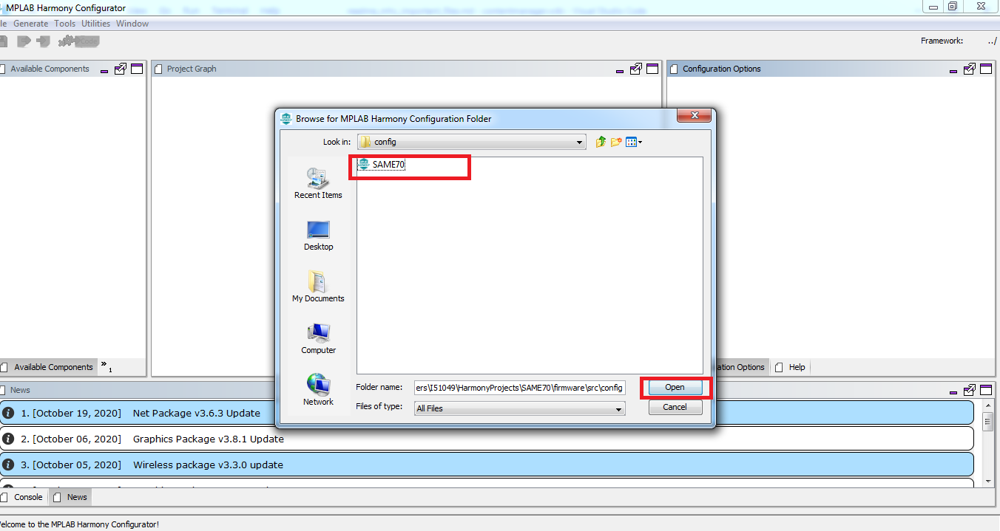

# MPLAB Harmony Configurator Important Files and MHC Stand Alone Mode (Without using MPLABX)

This section provides brief overview of MHC Importand Files and Stand Alone Mode

## Important Files

User should not edit/delete the MHC Important files. These files will help to identify the ".mhc folder" path and its contents detatils, harmony-manifest-success/failure file, group components and other project related important files.

### Important Files Content

* Harmony-Manifest-Success.yml : MHC generates Project Manifest to indicate the list of Harmony packages and its versions used in the project. Click here [Project Manifest](./readme_project_manifest.md) for details.

* Config/Config.mhc : All MHC configuration will be saved in ".mhc" configuration sub folder (firmware/src/config/configuration/.mhc). It contains component yml files and project settings.

## Load MHC project in Stand Alone Mode

MHC project can be loaded in stand alone mode by selecting ".mhc folder" parent directory (which was indicated with MHC project icon).

### Steps to launch MHC project in statndalone mode without using MPLABX

* Go to MHC folder directory (/Harmonypath/mhc/) and double click the runmhc.bat file.

* After launching mhc goto file menu and click on "Open Configuration"

* Select project location: (src/config/configuration_name/)

