## Simplifying Project Graphs with Groups
This section shows how to simplify the Project Graph by combining multiple components into a group.

There are 9 icons on the Project Graph toolbar:

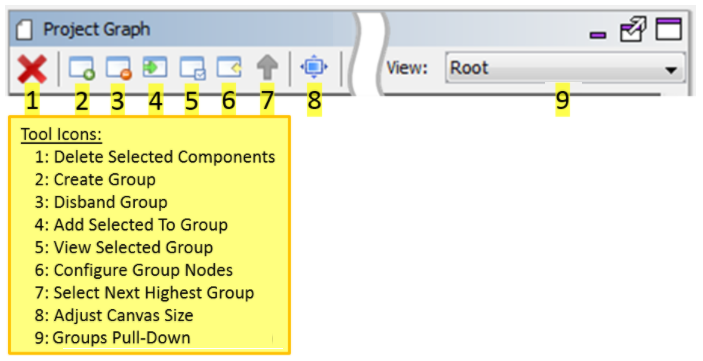

1. Delete Selected Components - Remove from the Project Graph the selected components.
2. Create Group - Groups aggregate two or more components or groups into a new "component" on the graph. This is very useful in simplifying a complex project graph containing many components.
3. Disband Group - The opposite of creating a group. The components and subgroups in the group are returned to the parent group or the main project graph.
4. Add Selected to Group - Add the selected component or group to another group identified by a pull-down menu.
5. View Selected Group - Change Project Graph to show the contents of the selected group. This is the same as double clicking on a group.
6. Configure Group Nodes - In the parent group or the main project graph, select a group and then select this icon. This will bring up a dialog to configure the nodes (connections) of that link outside components or groups to the contents of the selected group.
7. Select Next Highest Group - Moves the project graph up the group hierarchy to the parent group or main project graph.
8. Adjust Canvas Size - Adjusts the screen size of the project graph.
9. Groups Pull-Down - An alphabetical pull-down list of the project's groups.

A component group combines two or more components or groups into a new "component" on the Project Graph. Groups allow simplifying complex project graphs into a more understandable organization of project components. As a demonstration, below the Aria Quickstart graphics demonstration is used. It can be found under ./gfx/apps/aria_quickstart.

On the project graph there are three components related to supporting capacitive touch that can be combined into a group called "CapTouch":

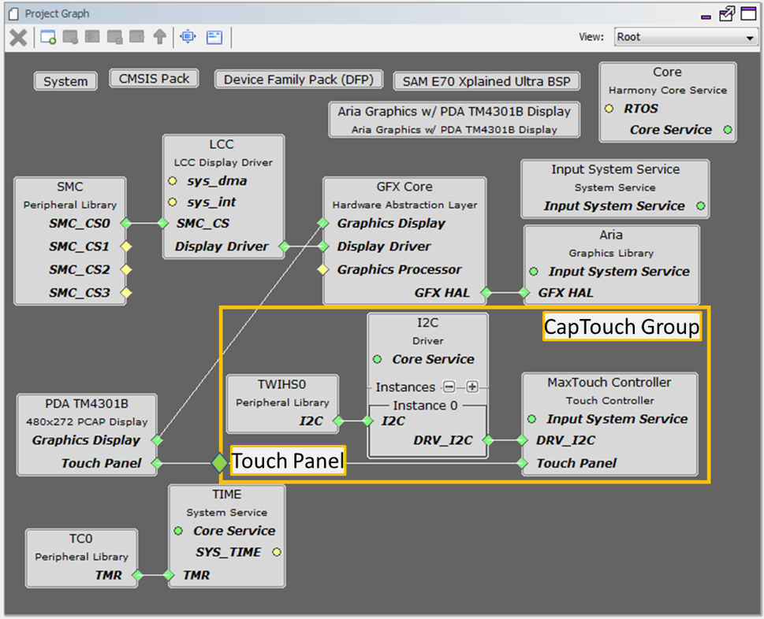

Three components combine into one group, with a node "Touch Panel" that connects to the display.
To start, select these three components:

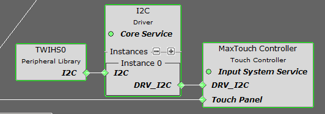

#### Container or Group Creation

The following are different group options. The Root is the default group.

* Create Group or click : Creates a group. If user selects any component and clicks  , then a pop-up is shown asking to automatically add selected components to the new group.
* Disband Group or click : Deletes a selected group. User can delete one group at a time. If user selects any component and clicks  ,then a pop-up is shown asking to delete selected group.
* Add selected to Group/Container or click : Adds selected component in to a target container. On clicking  a pop-up with drop down menu option is shown asking user to select the target container.
* View selected Group/Container or click : Select a group and click  or double click a group to view the components grouped together in a container.
* Configure Group Node or click : Select a group then click   to display the connections of the components if any. On clicking   a pop-up window is displayed showing the tabular list of available nodes, select the nodes to display in the group.
* Select Next Highest Group or click : Selects the next highest group available. Root is the default group. Select a group and click  or double click a group to view the components grouped together in a container then to select next highest group click  or to select a group under a drop down . 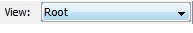

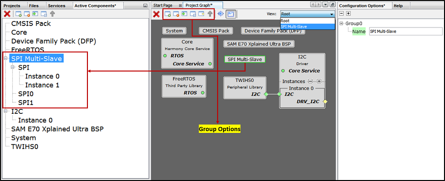

Multiple components added to group or container. This helps in simplifying the Project Graph view. The following figure illustrates the grouping of SPI Driver and SPI PLIB components. Similarly, user can create any number of group or container based on the requirement. Say for example separate container for TCP/IP and USB and so on. or based on the application need.

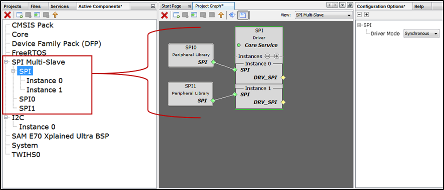

Then select the Create Group icon on the MHC toolbar:

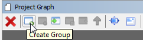

Answer Yes to the Create New Group dialog window:

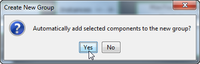

Next, select the group (Group0) just created in the graph and change its name in the Configuration Options window to CapTouch:

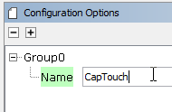

Double click on this new group and rearrange and reconnect the components:

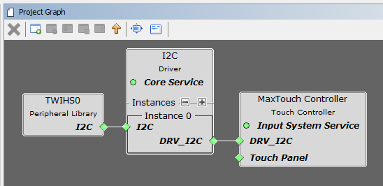

NOTE: Using a screen capture tool will help you remember how group components are connected. One of the few shortcomings to this MHC capability is that when groups are created or disbanded the prior connections among the group's components are forgotten by MHC. Having a snapshot of the component setup helps in reconstructing these connections.

Exit and return to the main graph by selecting the Up Arrow icon in the toolbar:

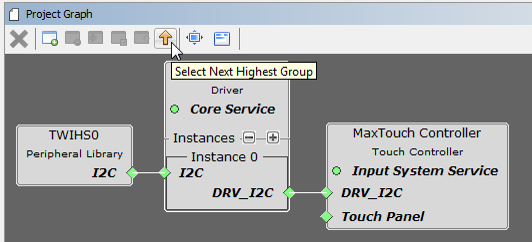

Next, configure the CapTouch group's Touch Panel node. Select the CapTouch group and then select the Configure Group Nodes icon on the toolbar:

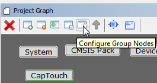

Enable the visibility of the touch_panel node belonging to the gfx_maxtouch_controller. Select Done to finish.

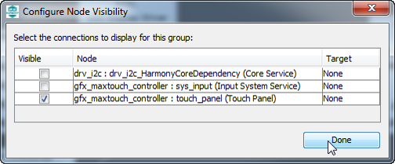

Finally, drag the CapTouch group down to be just to the right of the display component and connect the two Touch Panel nodes:

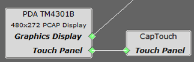

In the end, the project graph is simpler:

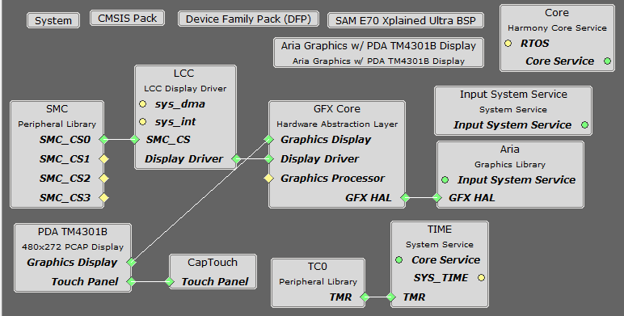

