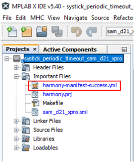

# Project Manifest

MHC generates Project Manifest to indicate the list of Harmony packages and its versions used in the project.
**Manifest File** file is added to the MPLAB X Project

.

The content of a sample manifest file is show below

The manifest file includes:
1. Project Name
2. Creation date and time
3. Operating System
4. MHC Mode
5. MPLAB X IDE version
6. MPLAB Harmony Configurator (MHC) Plugin version
7. XC32 Compiler version
8. List of Harmony packages and its versions used in the project

When MHC is launched on any existing project, MHC compares the package and its version used in the project vs what is available in the local package.
- It will launch MHC if the location package version is same as the package versions used in the project.
- It will pop up a warning dialog if the local package version is different the package version used in the project.
[Content Manager](https://github.com/Microchip-MPLAB-Harmony/contentmanager/wiki) can be used to setup the local packages and versions based on this manifest file.

