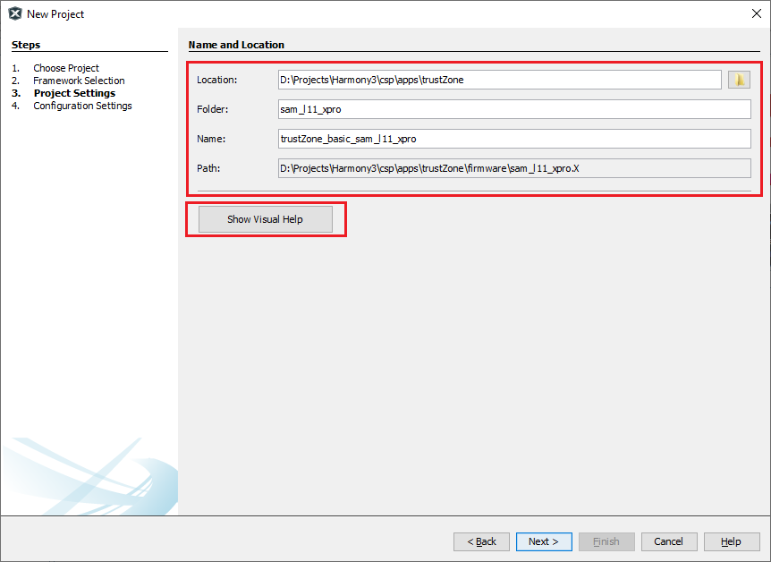
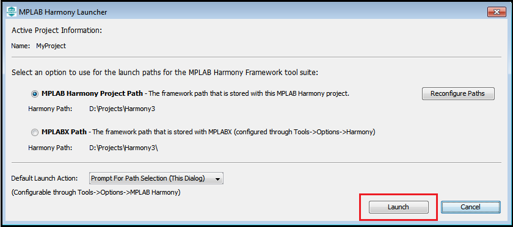
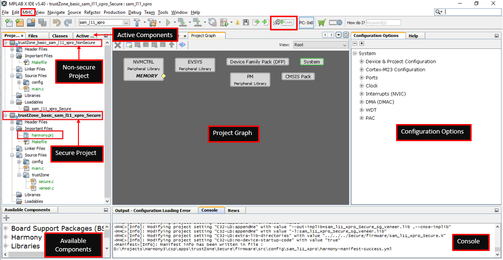

# Creating MPLAB® Harmony 3 TrustZone-M Project using MPLAB® X IDE

To create a new TrustZone project, in MPLAB® X IDE, Select File > New Project or click . The New Project wizard will open. Perform following steps:

1. Choose Project:
   - In the Choose Project pane, select the Microchip Embedded category.
   - In the Projects pane, select 32-bit MPLAB® Harmony 3 Project, then click Next.
    

    **Note**: If the 32-Bit MPLAB® Harmony 3 Project type is not listed under the Microchip Embedded category, please download and install MPLAB® Harmony 3 Configurator before continuing with these steps.
2. Framework Selection:
   - Provide the framework path where Harmony 3 repositorries have been downloaded, then click Next.

    

3. Project Settings:
    - Location: Indicates the path to the root folder of the new project. All project files will be placed in this folder.
    - Folder: Indicates the name of the MPLAB® X IDE folder.
    - Name: Enter name of the project which you want to see in MPLAB® X IDE, click Next.
    - Path: The path information will be updated automatically as and when users make changes to other fields.

    

    **Note**: Click the "Show Visual Help" button to open a contextual help window for a detailed description of various fields in the Project Settings.

4. Configuration Settings:
   - Name: Enter the configuration name.
   - Target Device: Choose target device
   - TrustZone Enabled: Select checkbox and click Finish to launch MPLAB® Harmony Configurator (MHC). After clicking the Finish button, MHC will create Secure and Non-secure MPLAB® X Projects.

    

5. Launching MHC from MPLAB X
	- After selecting the target device, click Finish to launch MHC.
	- Users can also launch MHC by selecting **Tools > Embedded > MPLAB® Harmony 3 Configurator** from the MPLAB X IDE
		
	

	* If necessary, reconfigure the MPLAB® X Harmony framework paths by clicking the Reconfigure Paths button. Otherwise, accept the default settings and then click Launch.
	
	
	
	- For TrustZone devices, the MHC Generates two projects viz., Secure and Non-Secure Project that work together on the same MCU and offering security isolation between the Trusted and the Non-trusted resources in the device.
		* Non-secure project is selected as Main Project to launch MHC. 
		* Secure project is selected as a loadable project from the Non-secure project. When Non-secure Project builds, it first builds Secure Project and then Non-secure project and  generates target binaries to be executed on the device.
	
	

6. Launch TrustZone-M Manager 
	- Launch TrustZone manager
	
	

	- Memory Configuration
		* MHC generates fuse setting in secure project and it programmed as part of secure image to partition memory between secure and non-secure project
		* MHC 3 generates linker macros in secure and non-secure project to define the memory region in linker file as per fuse configuration
	

	- Peripheral Configuration
		* MHC generates fuse setting in secure project to assign peripheral to non-secure project
	

#  Configure and Generate code with MHC
* Refer to [MHC Configuration](./readme_mhc_configuration.md) page for details on how to add, configure and interconnect required software components

* [Save MHC Configuration and Generate Code](./readme_generate_code.md).

* Once the Harmony code is generated, user application should be developed in "main.c" or "app.c" of the secure and non-secure project.

#  Build and Program with MPLAB X IDE
* Make Non-Secure Project as main project
	- For TrustZone devices, the MHC Generates two projects viz., Secure and Non-Secure Project that work together on the same MCU and offering security isolation between the Trusted and the Non-trusted resources in the device.
	- Secure project is selected as a loadable project from the Non-secure project. When Non-secure Project builds, it first builds Secure Project and then Non-secure project and  generates target binaries to be executed on the device.

* In MPLAB® X IDE, go to **File > Project Properties**, and make sure that appropriate compiler version, hardware tools and DFP version should be selected.
	

* Clean and build your application by clicking on the **Clean and Build** button as shown below.
	

* Program your application to the device by clicking on the **Make and Program** button as shown below.
	